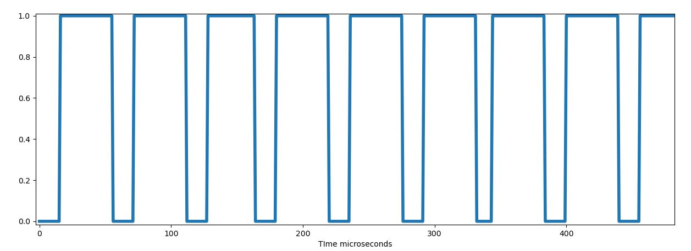
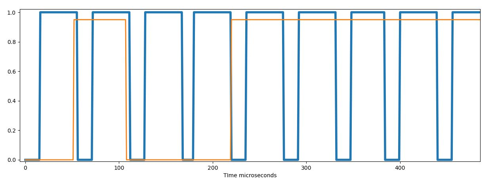

https://pandao.github.io/editor.md/en.html

### one_channel_analog_read_.ino - one channel analyzer check
    The utility frequency, (power) line frequency is 50Hz
    1 period = 1/50
    1 period = 0.02 s
    0.02s = 20,000 μs
    therefore, if we insert antennas into digital pin 2 and analog pin a0, 
    we will get a meander with a frequency of 50 Hz and a period of 20 000 μs

### one_channel.ino - one channel analyzer
    Attach signal source between digital pin 2 and gnd, read output 

### two_channel.ino - one channel analyzer
    Attach signal source between digital pin 2,digital pin 3 and gnd, read output  (2 strings)

