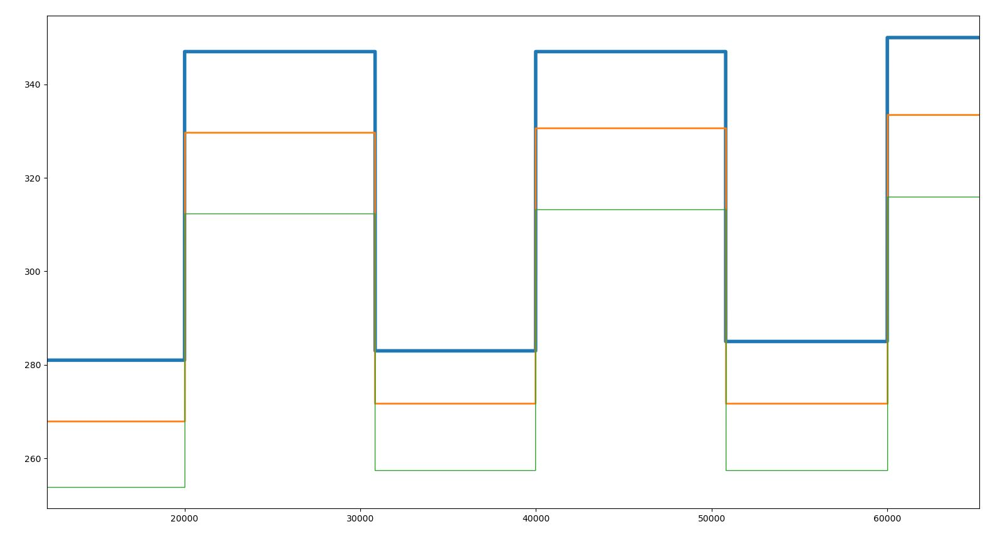

### one_channel_analog_read_.ino - analyzer operation check
    mains frequency - 50Hz
    1 period = 1/50
    1 period = 0.02 s
    0.02s = 20,000 μs
    therefore, if we insert antennas into pin 2 and pin a0, we will get a meander with a frequency of 50 Hz and a period of 20 000 μs

